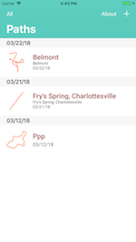
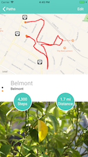
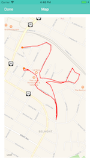
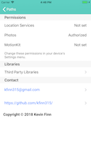

# CrumbPath (Swift)

A maps and tracks app for iOS. CrumbPath lets you keep track of your daily routes, recording distance, time and step count. It also lets you attach photos that you've taken along the way.

The app is available on the iTunes store as 'PathCrumbs' at: https://itunes.apple.com/us/app/pathcrumbs/id1243888253?mt=8 

## Built With these Libraries

* [RxSwift](https://github.com/ReactiveX/RxSwift) - Reactive library for Swift
* [RxCoreData](https://github.com/RxSwiftCommunity/RxCoreData) - Reactive extensions for CoreData
* [RxDataSources](https://github.com/RxSwiftCommunity/RxDataSources) - Reactive extensions for UITableView
* [AssetsPicker](https://github.com/DragonCherry/AssetsPickerViewController)  - Handy photo picker library
* [Eureka](https://github.com/xmartlabs/Eureka) - Handy form building library
* [LicensesKit](https://github.com/mattwyskiel/LicensesKit) - Handy way to add 3rd party library attributions in your app
* [SwiftyBeaver](https://github.com/SwiftyBeaver/SwiftyBeaver) - Handy logging tool
* [Swift Simplify](https://github.com/malcommac/SwiftSimplify) - Library for simplifying paths

## Screenshots

## Author

* **Kevin Finn** - [kfinn315@gmail.com]

## License

This project is licensed under the MIT License - see the [LICENSE.md](LICENSE.md) file for details
